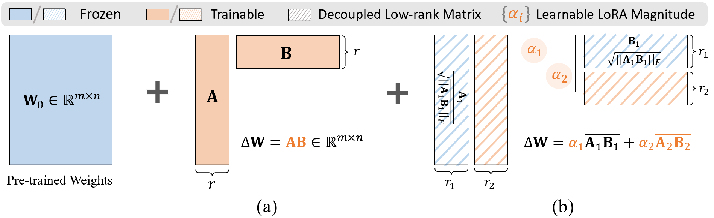
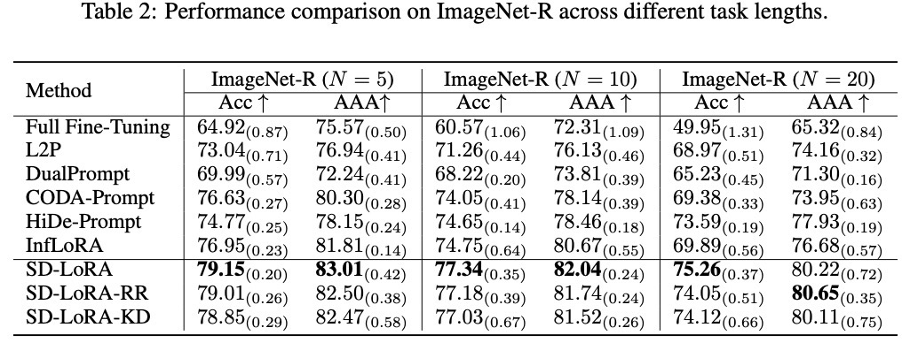

# SD-LoRA: Scalable Decoupled Low-Rank Adaptation for Class Incremental Learning

Welcome to the official code repository for [SD-LoRA: Scalable Decoupled Low-Rank Adaptation for Class Incremental Learning **(ICLR 2025, Oral)**](https://openreview.net/pdf?id=5U1rlpX68A).

If you find this code useful in your research then please cite  
```bash
@article{wu2025SDLoRA,
  title={SD-LoRA: Scalable Decoupled Low-Rank Adaptation for Class Incremental Learning},
  author={Wu, Yichen and Piao, Hongming and Huang, Long-Kai and Wang, Renzhen and Li, Wanhua and Pfister, Hanspeter and Meng, Deyu and Ma, Kede and Wei, Ying},
  journal={The Thirteenth International Conference on Learning Representations},
  year={2025}
}
``` 

## 👀 Introduction


- SD-LoRA introduces a decoupled learning strategy for the magnitude and direction of LoRA components to achieve scalable continual learning without rehearsal of huge sample features.
- It demonstrates a strong stability-plasticity trade-off by converging to overlapping low-loss regions across sequential tasks, supported by empirical and theoretical analysis.
- SD-LoRA and its two variants enable end-to-end optimization and efficient inference without component selection, achieving state-of-the-art performance on multiple CL benchmarks and foundation models.

## 📜 Results


- To run the experiments, download the datasets to /data/ and execute:
   ```bash
  bash run.sh
- For your convenience, we have provided the running logs in the log file, where you can find detailed performance results for all streaming tasks.


## 🙏 Acknowledgement
This repo is built upon the following projects:

* [LoRA-ViT](https://github.com/JamesQFreeman/LoRA-ViT)
* [PILOT](https://github.com/sun-hailong/LAMDA-PILOT)
